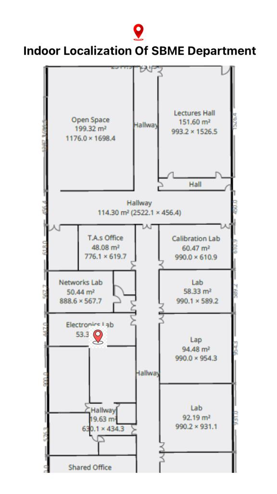
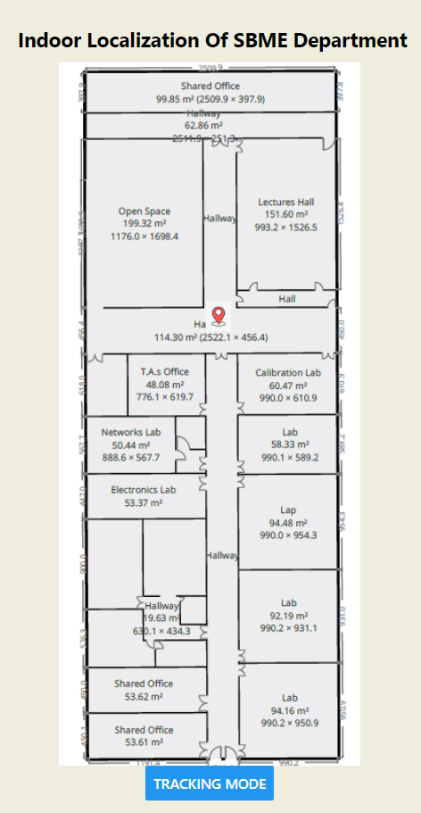

## A WiFi tracking module using ESP8266 MCU which the user can use to localize and track the current location through either a mobile application or a website.

## Features:
- The user can visualize a basic map for the location and see a flashing point moving on the map
representing the tracked moving object.
- The user can replay the motion of the object during the last time period (corresponding to like
50 time point).

# requirements for running the project

## 1- Get your own IP address by using cmd of your device and type 
```
ipconfig
```
or if you're using linux, open the terminal and type 
``` 
ifconfig 
```

- then make sure to change the existing IP in 'esp.ino', 'App.js' in both folders (reactapp) and (reactnative-app1) 

- Make sure to change SSID and password in the arduino code.

## 2- Create virtual Environment 

```
pip install virtualenv
virtualenv venv 
```

#### PS Don't forget to activate your virtual environment
```
source venv/bin/activate
```

#### In case working with windows activation may fail so check next link

[Activation](https://stackoverflow.com/questions/18713086/virtualenv-wont-activate-on-windows)

## 2- Run server.py to run server 

> install requirements first : 
> ```
> python -m pip install -r requirements.txt
> ```

```
python server.py
```
## 3- Make sure to be in reactapp directory and run following commands for the webapp

```
npm install
npm start
```

## 4- For the mobile application make sure to be in reactnative-app directory and run following commands

```
npm install
npm start
```

## Testing APIS
1- visit http://localhost:8090/mapping to see location predicted from Random Forest Classifier

### Snapshot of the mobile application


### Snapshot for the reactapp existing in the hallwayTwo

* there is a tracking mode which saves the last 50 readings and show them in reverse.